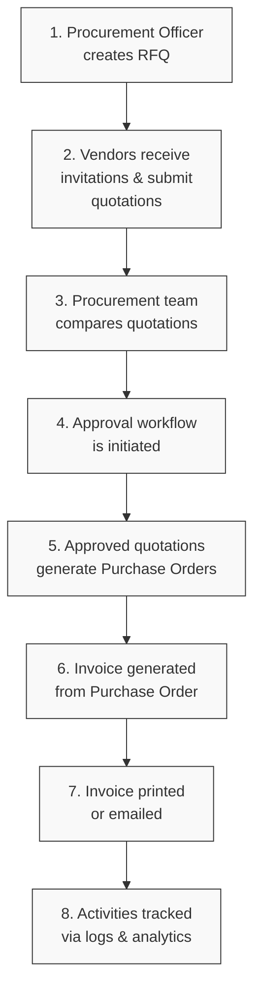
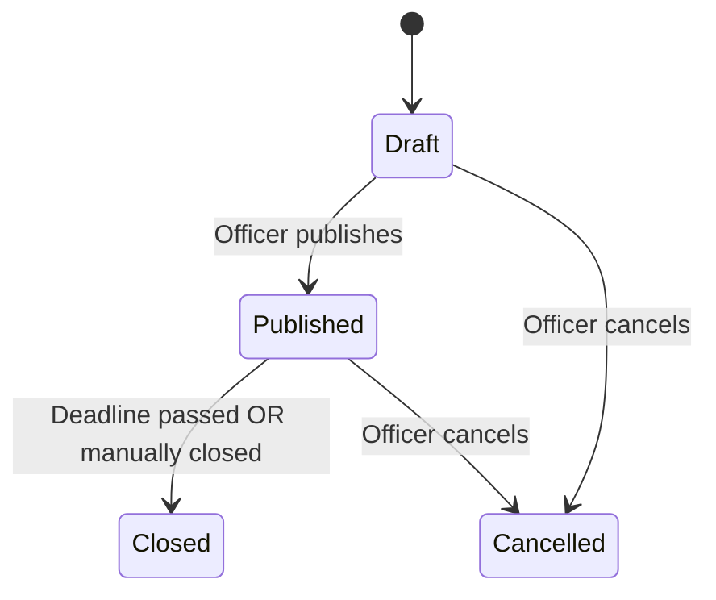
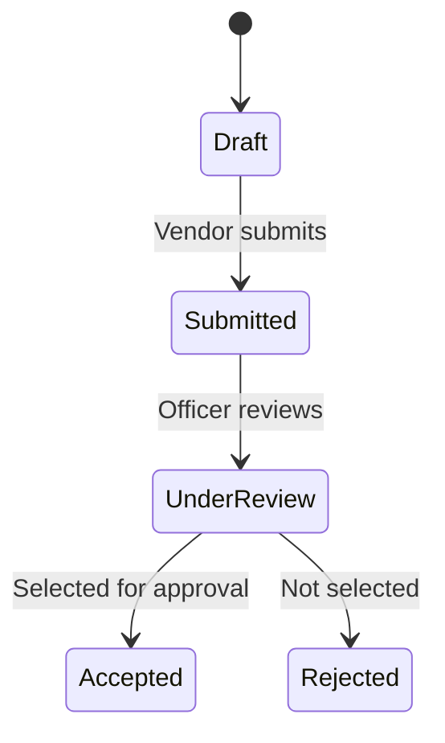
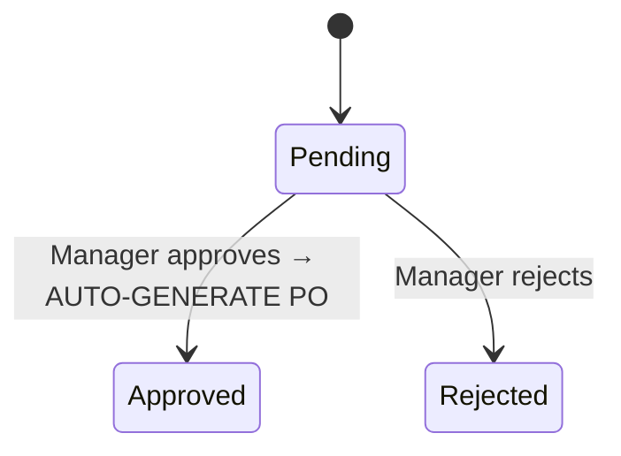
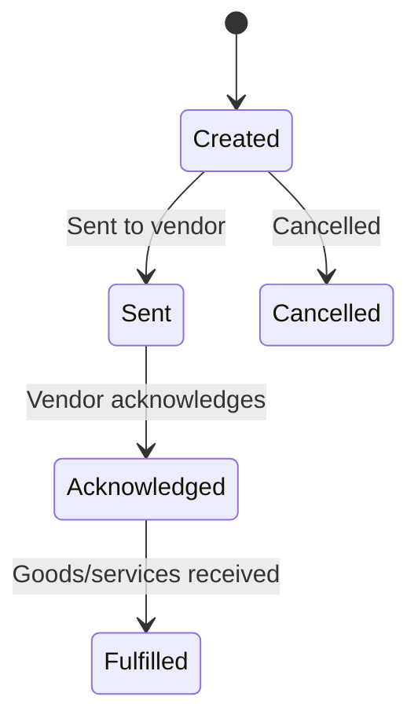
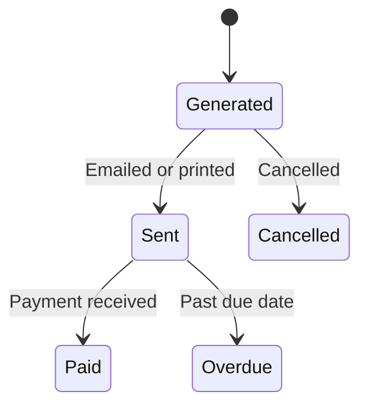

# VendorBridge ERP — Procurement & Vendor Management

<p align="center">
  
  
  
  
  
  
</p>

VendorBridge is a centralized ERP platform that digitizes and simplifies procurement operations. It allows organizations to manage vendors, Requests for Quotation (RFQs), quotations, approvals, purchase orders, and invoice generation—all in one place. By enabling structured workflows, centralized vendor communication, and real-time tracking, VendorBridge reduces manual inefficiencies and modernizes the procurement lifecycle.

---

## 🎯 Problem Statement
Organizations struggle with manual, fragmented procurement processes. VendorBridge solves this by providing a unified Procurement & Vendor Management ERP where organizations can:
- **Register and manage vendors**
- **Create RFQs**
- **Receive vendor quotations**
- **Compare quotations**
- **Process procurement approvals**
- **Generate purchase orders**
- **Generate invoices**
- **Print and email invoices**
- **Track procurement activities**

The application demonstrates proper ERP architecture, reusable modules, secure role-based workflows, and intuitive UI/UX.

---

## 🔄 Core Workflow

The procurement process follows a strict sequential lifecycle to ensure compliance and accountability:



---

## 🚦 Key State Machines

To ensure data integrity, every major entity in the system is governed by a strict state machine.

### 1. RFQ Status Flow


### 2. Quotation Status Flow


### 3. Approval Status Flow


### 4. Purchase Order Status Flow


### 5. Invoice Status Flow


---

## 🛠️ Tech Stack & Architecture

### Frontend
- **Framework**: Next.js 14 (App Router)
- **UI Library**: shadcn/ui + Tailwind CSS
- **State Management**: Zustand
- **Icons**: Lucide React
- **Animations**: Framer Motion

### Backend
- **Framework**: FastAPI (Async Python)
- **Database ORM**: SQLAlchemy 2.0
- **AI Integration**: LangGraph (Quotation Analysis & Recommendations)
- **PDF Generation**: ReportLab
- **Authentication**: JWT & Supabase Auth Integration

### Database
- **Platform**: Supabase (PostgreSQL)
- **Features Used**: Row Level Security (RLS), Supabase Storage (for PDFs & Attachments)

---

## 🚀 Key Features

1. **Role-Based Access Control**: Different views and capabilities for Admins, Procurement Officers, Managers, and Vendors.
2. **Automated Document Generation**: One-click generation of beautifully formatted Purchase Order and Invoice PDFs.
3. **Seamless Email Integration**: Send invoices directly to vendors from within the platform.
4. **Comprehensive Analytics**: Dashboard and Reports screens showing spend trends, category breakdowns, and vendor performance.
5. **Complete Audit Trail**: Every action is logged in the Activity feed for compliance.

## 🚧 Features We Are Still Working On

- **AI-Powered Quotation Analysis**: LangGraph agent analyzes vendor quotes and recommends the best value based on price, delivery time, and vendor rating.

---

## 💻 Getting Started (Local Development)

### 1. Clone the repository
```bash
git clone https://github.com/Het-Mengar66/Vendor-Bridge-ERP-.git
cd Vendor-Bridge-ERP-
```

### 2. Backend Setup
```bash
cd backend
python -m venv venv
source venv/bin/activate  # On Windows: venv\Scripts\activate
pip install -r requirements.txt

# Create .env file based on .env.example
# Run migrations/setup
python reset_db.py
python seed.py

# Start FastAPI server
python -m uvicorn app.main:app --reload
```

### 3. Frontend Setup
```bash
cd frontend
npm install

# Create .env.local file with API and Supabase URLs
# Start Next.js development server
npm run dev
```

### 4. Access the Platform
- **Frontend**: `http://localhost:3000`
- **Backend API Docs**: `http://localhost:8000/docs`

#### Demo Credentials:
- **Admin**: `admin@vendorbridge.com` (any password)
- **Vendor**: `vendor@techsupplies.com` (any password)

---

> Built with ❤️ for seamless procurement and vendor management.
